# User Dashboard - Vue.js Application

A production-ready, responsive Vue.js application that fetches and displays user data from the JSONPlaceholder API, with interactive filtering, sorting features, and detailed user views. This project demonstrates best practices in Vue.js development, focusing on maintainability, performance, and user experience.

## Goto this site
[https://test-user-management-ten.vercel.app/](https://test-user-management-ten.vercel.app/)

## Screenshots

### User Dashboard

#### Light Theme
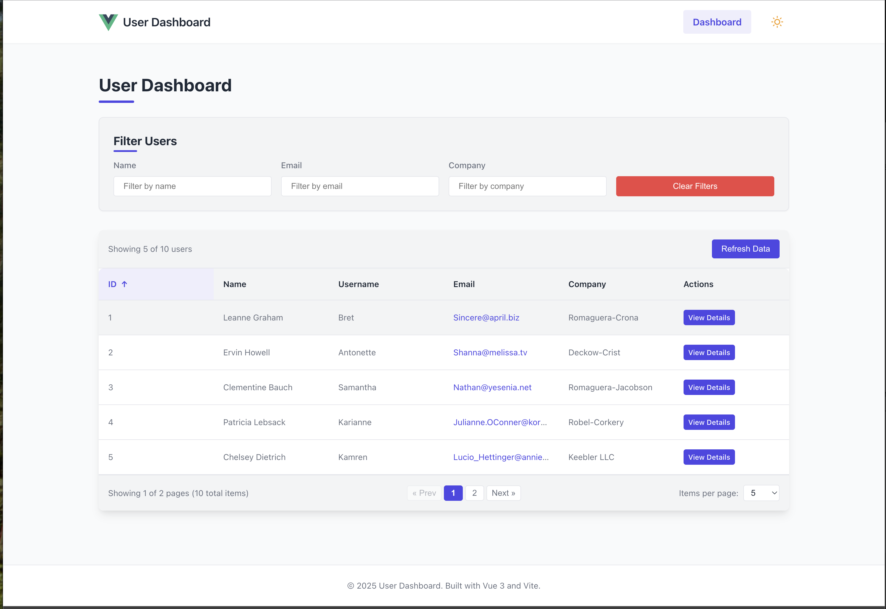

#### Dark Theme
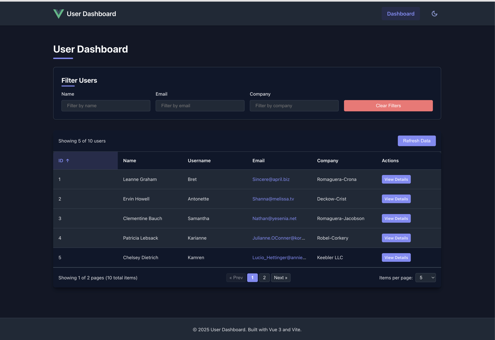

### User Details View

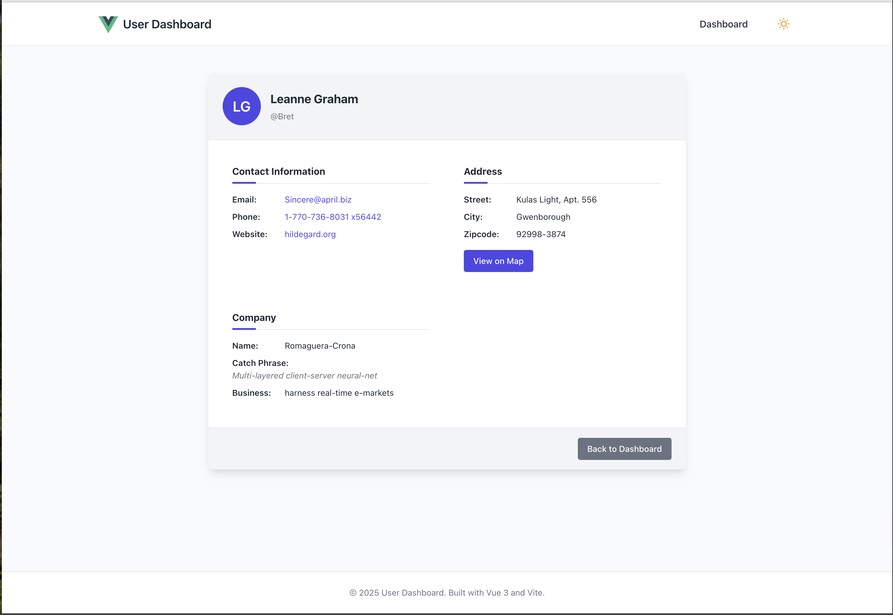

### Mobile Responsiveness

#### User Dashboard - Mobile View
<div style="display: flex; gap: 20px; justify-content: center;">
  <div>
    <p align="center"><strong>Light Theme</strong></p>
    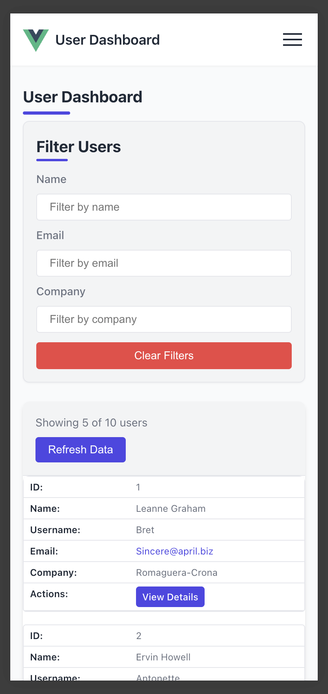
  </div>
  <div>
    <p align="center"><strong>Dark Theme</strong></p>
    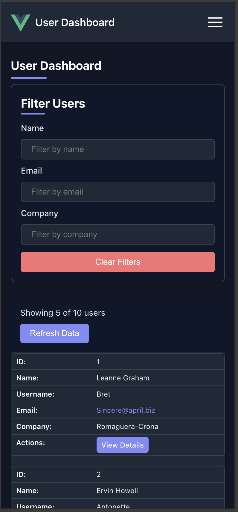
  </div>
</div>

#### User Details - Mobile View
<div style="display: flex; gap: 20px; justify-content: center;">
  <div>
    <p align="center"><strong>Light Theme</strong></p>
    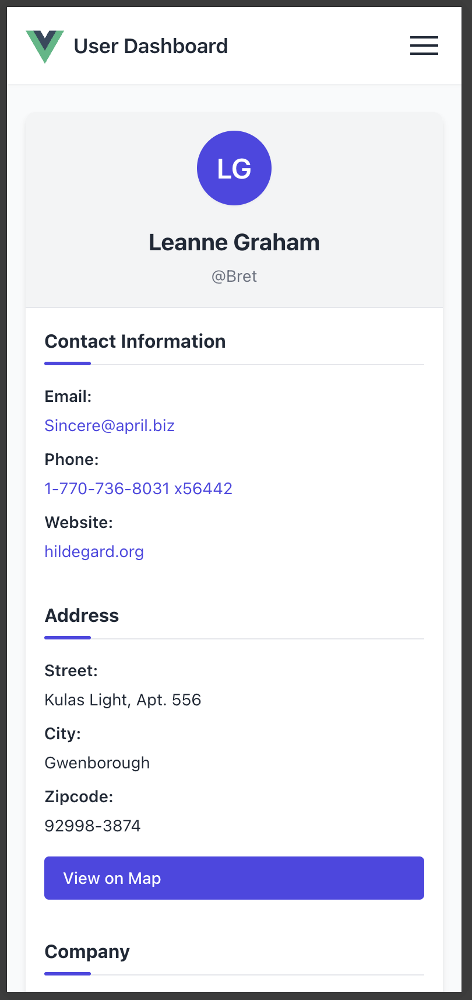
  </div>
  <div>
    <p align="center"><strong>Dark Theme</strong></p>
    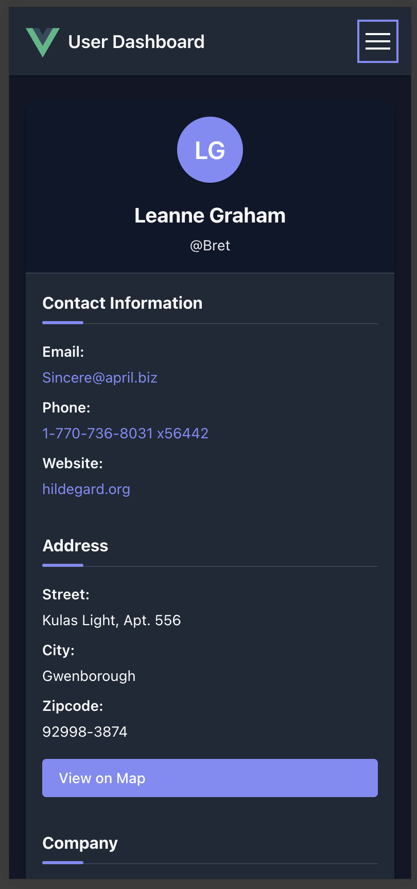
  </div>
</div>

#### Additional User Details - Mobile View
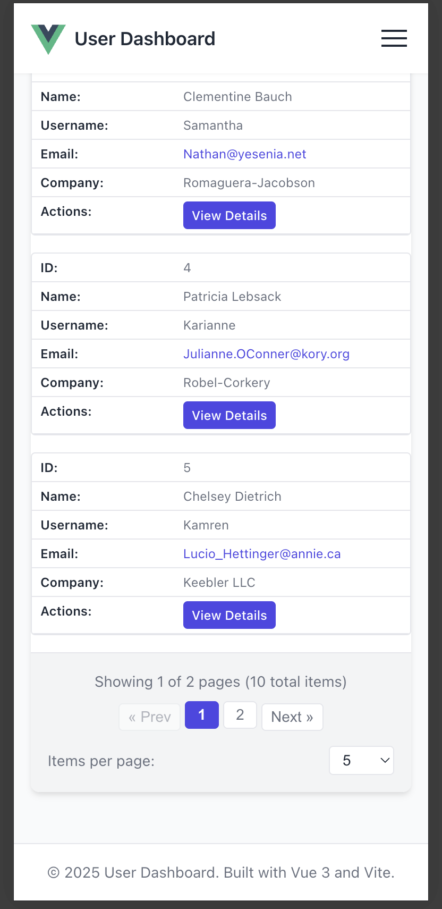

### Navigation

#### Mobile Navigation Menu
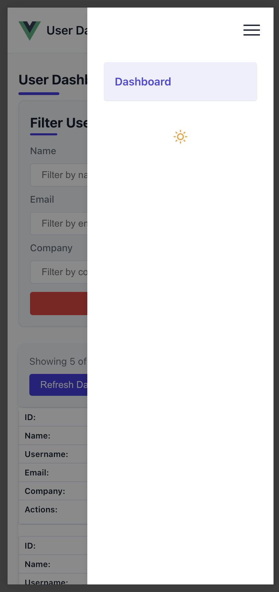

### Error Handling

#### 404 Page Not Found
<div style="display: flex; gap: 20px; justify-content: center;">
  <div>
    <p align="center"><strong>Desktop View</strong></p>
    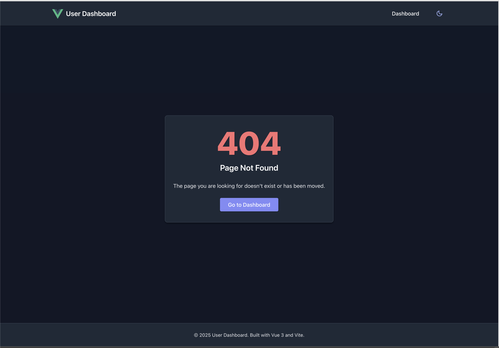
  </div>
  <div>
    <p align="center"><strong>Mobile View</strong></p>
    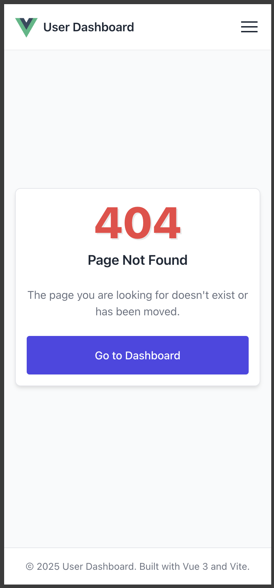
  </div>
</div>

#### API call Error
<div style="display: flex; gap: 20px; justify-content: center;">
  <div>
    <p align="center"><strong>Desktop View</strong></p>
    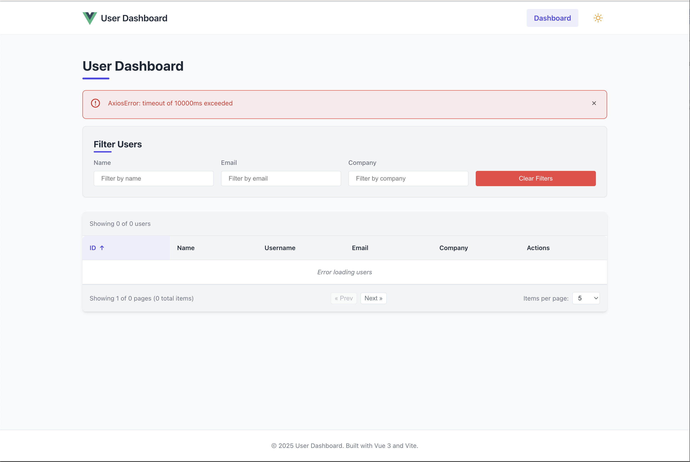
  </div>
</div>

#### User not found
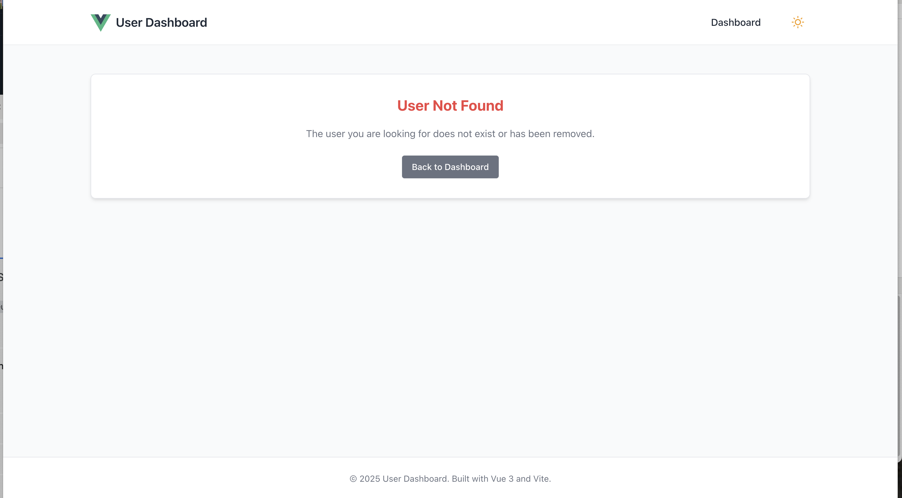

## Table of Contents

- [Screenshots](#screenshots)
- [Features](#features)
- [Technology Stack](#technology-stack)
- [Architecture and Design Patterns](#architecture-and-design-patterns)
- [Key Features Implementation](#key-features-implementation)
- [Performance Optimizations](#performance-optimizations)
- [Security Considerations](#security-considerations)
- [Technical Challenges and Solutions](#technical-challenges-and-solutions)
- [Getting Started](#getting-started)
- [Testing](#testing)
- [Future Enhancements](#future-enhancements)
- [Project Structure](#project-structure)

## Features

- **Responsive Design**: Fully responsive UI that works seamlessly on desktop, tablet, and mobile devices
- **Data Fetching**: Efficient data retrieval from JSONPlaceholder API with proper error handling
- **Interactive Filtering**: Real-time filtering of users by name, email, and company
- **Dynamic Sorting**: Sort users by any column (ID, name, username, email, company) with direction toggle
- **Pagination**: Efficient handling of large datasets with customizable page size and intuitive navigation
- **User Details View**: Comprehensive user profile with contact information, address with map integration, and company details
- **Error Handling**: Graceful error handling with user-friendly messages and recovery options
- **Loading States**: Visual feedback during data loading operations
- **Clean UI/UX**: Intuitive interface with consistent styling and smooth transitions
- **Theme Switching**: Dynamic light and dark theme support with the following features:
  - System preference detection using `prefers-color-scheme` media query
  - Real-time theme updates when system preferences change
  - User preference persistence in localStorage
  - Accessible theme toggle with proper ARIA attributes
  - Smooth transitions between themes
  - Comprehensive CSS variable-based theming system

## Technology Stack

- **Vue 3**: Latest version of the Vue.js framework with Composition API
- **TypeScript**: Static typing for improved developer experience, code quality, and maintainability
- **Vite**: Next-generation frontend tooling for faster development and optimized builds
- **Vue Router 4**: Official router for Vue.js with improved TypeScript support
- **TanStack Query (Vue Query)**: Data fetching and state management library
- **Axios**: Promise-based HTTP client for API requests with interceptor support

## Architecture and Design Patterns

The application follows a clean, maintainable architecture based on several design patterns:

### Component Architecture

- **Atomic Design Methodology**: Components are organized following atomic design principles:
- **UI Components**: Small, reusable components like `LoadingSpinner` and `ErrorAlert`
- **Feature Components**: Domain-specific components like `UserTable` and `UserFilter`
- **View Components**: Page-level components that compose feature components

### State Management

- **TanStack Query Pattern**: Using Vue Query for data fetching and state management:
- **Query Hooks**: Custom composable functions for data fetching
- **Query Keys**: Hierarchical structure for caching and invalidation
- **Query Client**: Centralized cache management
- **Reactive State**: Automatic synchronization of UI with query state

### Service Layer Pattern

- **API Service Abstraction**: Encapsulated API calls in service modules
- **Axios Interceptors**: Centralized request/response handling and error management

### Composition API

- **Composable Functions**: Reusable logic extracted into composable functions
- **Separation of Concerns**: Clear separation between UI rendering and business logic

### Reactive Programming

- **Reactive Data Flow**: One-way data flow with reactive state updates
- **Computed Properties**: Efficient derived state calculations

### TypeScript Integration

- **Strong Typing**: Comprehensive type definitions for all data structures and functions
- **Type Safety**: Catch errors at compile time rather than runtime
- **Interface Definitions**: Clear contracts for component props, API responses, and state
- **Type Inference**: Leveraging TypeScript's ability to infer types when possible
- **Generics**: Used for reusable, type-safe components and functions

## Key Features Implementation

### Filtering System

The filtering system allows users to filter the displayed data by multiple criteria simultaneously:

```typescript
// Filtering implementation in useUsers.ts hook
const filteredUsers: ComputedRef<User[]> = computed(() => {
  if (!users.value || users.value.length === 0) return [];

  const filtered = users.value.filter(user => {
    const nameMatch = user.name.toLowerCase().includes(filters.value.name.toLowerCase());
    const emailMatch = user.email.toLowerCase().includes(filters.value.email.toLowerCase());
    const companyMatch = user.company.name.toLowerCase().includes(filters.value.company.toLowerCase());

    return nameMatch && emailMatch && companyMatch;
  });

  // Update pagination totals
  pagination.value.totalItems = filtered.length;
  pagination.value.totalPages = Math.ceil(filtered.length / pagination.value.pageSize);

  return filtered;
});
```

Key aspects:

- Case-insensitive matching
- Real-time filtering as users type
- Multiple filter criteria with AND logic
- Reactive updates through Vue Query and Vue's reactivity system

### Sorting Mechanism

The sorting system allows users to sort by any column with direction toggle:

```typescript
// Sorting implementation in useUsers.ts hook
const sortedUsers: ComputedRef<User[]> = computed(() => {
  if (!filteredUsers.value || filteredUsers.value.length === 0) return [];

  return [...filteredUsers.value].sort((a, b) => {
    let fieldA: any, fieldB: any;

    // Handle nested fields like company.name
    if (sortBy.value.field === 'company') {
      fieldA = a.company.name;
      fieldB = b.company.name;
    } else {
      fieldA = a[sortBy.value.field as keyof User];
      fieldB = b[sortBy.value.field as keyof User];
    }

    // Case insensitive string comparison
    if (typeof fieldA === 'string') {
      fieldA = fieldA.toLowerCase();
      fieldB = fieldB.toLowerCase();
    }

    if (sortBy.value.direction === 'asc') {
      return fieldA > fieldB ? 1 : -1;
    } else {
      return fieldA < fieldB ? 1 : -1;
    }
  });
});
```

Key aspects:

- Support for nested object properties (company.name)
- Type-aware comparisons
- Direction toggle (ascending/descending)
- Visual indicators for sort field and direction

### Pagination Implementation

The pagination system efficiently handles large datasets by dividing them into manageable pages:

```typescript
// Pagination implementation in useUsers.ts hook
const paginatedUsers: ComputedRef<User[]> = computed(() => {
  if (!sortedUsers.value || sortedUsers.value.length === 0) return [];

  const startIndex = (pagination.value.currentPage - 1) * pagination.value.pageSize;
  const endIndex = startIndex + pagination.value.pageSize;

  return sortedUsers.value.slice(startIndex, endIndex);
});
```

Key aspects:

- Client-side pagination for efficient rendering
- Customizable page size (5, 10, 20, 50, 100 items per page)
- Intuitive navigation controls with page numbers
- Automatic recalculation when filters or sorting change
- Maintains state when switching between views

### Responsive Design Implementation

The application uses a mobile-first approach with CSS Grid and Flexbox:

```css
/* Example of responsive grid in UserFilter.vue */
.filter-form {
  display: grid;
  grid-template-columns: repeat(auto-fill, minmax(250px, 1fr));
  gap: 1rem;
  align-items: end;
}

@media (max-width: 768px) {
  .filter-form {
    grid-template-columns: 1fr;
  }
}
```

Key aspects:

- Fluid layouts with CSS Grid and Flexbox
- Responsive typography with relative units
- Breakpoints for different device sizes
- Touch-friendly UI elements for mobile

### Theme Switching Implementation

The application features a comprehensive theme switching system with light and dark modes:

```typescript
// Theme composable in useTheme.ts
export function useTheme() {
  // Create a reactive reference to store the current theme
  const theme = ref<ThemeType>('light');

  // Check if system prefers dark mode
  const systemPrefersDark = computed(() => {
    if (typeof window === 'undefined') return false;
    return window.matchMedia('(prefers-color-scheme: dark)').matches;
  });

  // Initialize theme from localStorage or system preference
  const initializeTheme = (): void => {
    const storedTheme = localStorage.getItem('theme') as ThemeType | null;

    if (storedTheme) {
      // Use stored theme if available
      theme.value = storedTheme;
    } else {
      // Otherwise use system preference
      theme.value = systemPrefersDark.value ? 'dark' : 'light';
    }

    // Apply theme to document
    applyTheme(theme.value);
  };

  // Listen for system preference changes
  onMounted(() => {
    window.matchMedia('(prefers-color-scheme: dark)').addEventListener('change', (e) => {
      if (!localStorage.getItem('theme')) {
        // Only update if user hasn't manually set a preference
        theme.value = e.matches ? 'dark' : 'light';
      }
    });
  });
}
```

Key aspects:

- **System Preference Detection**: Automatically detects and applies the user's system theme preference using the `prefers-color-scheme` media query
- **Real-time Preference Monitoring**: Listens for changes to the system's theme preference and updates the application theme in real-time when the user hasn't explicitly set a preference
- **User Preference Persistence**: Stores the user's explicit theme choice in localStorage, which takes precedence over system preferences
- **CSS Variables for Theming**: Uses CSS custom properties to define theme-specific colors and styles
- **Smooth Theme Transitions**: Implements smooth transitions between themes for a polished user experience
- **Accessible Toggle**: Provides an accessible theme toggle with proper ARIA attributes and keyboard support
- **Semantic HTML**: Uses the `data-theme` attribute on the root element to apply theme styles

The CSS implementation uses CSS variables for theme-specific styling:

```css
/* Light theme (default) */
:root[data-theme="light"] {
  /* Primary Colors */
  --primary-color: #4f46e5;
  --primary-dark: #4338ca;
  --primary-light: #818cf8;

  /* Background Colors */
  --bg-color: #f9fafb;
  --bg-light: #ffffff;
  --bg-dark: #f3f4f6;

  /* Text Colors */
  --text-color: #1f2937;
  --text-light: #6b7280;
}

/* Dark theme */
:root[data-theme="dark"] {
  /* Primary Colors */
  --primary-color: #818cf8;
  --primary-dark: #6366f1;
  --primary-light: #a5b4fc;

  /* Background Colors */
  --bg-color: #111827;
  --bg-light: #1f2937;
  --bg-dark: #0f172a;

  /* Text Colors */
  --text-color: #f9fafb;
  --text-light: #e5e7eb;
}

/* Theme transition for smooth switching */
* {
  transition: color 0.3s ease, background-color 0.3s ease, border-color 0.3s ease;
}
```

The theme toggle component is designed with accessibility in mind:

```vue
<template>
  <button
    class="theme-toggle"
    @click="toggleTheme"
    :aria-label="isDark ? 'Switch to light theme' : 'Switch to dark theme'"
    :title="isDark ? 'Switch to light theme' : 'Switch to dark theme'"
    aria-live="polite"
    role="switch"
    :aria-checked="isDark"
  >
    <!-- Sun/Moon icons -->
    <svg v-if="!isDark" class="icon sun-icon" viewBox="0 0 24 24">
      <!-- Sun icon paths -->
    </svg>
    <svg v-else class="icon moon-icon" viewBox="0 0 24 24">
      <!-- Moon icon paths -->
    </svg>

    <span class="sr-only">{{ isDark ? 'Dark mode active' : 'Light mode active' }}</span>
  </button>
</template>
```

## Performance Optimizations

### Efficient Rendering

- **Computed Properties**: Used for derived data to prevent unnecessary recalculations
- **Reactive Dependencies**: Careful management of reactive dependencies to prevent unnecessary re-renders
- **v-once Directive**: Applied to static content that doesn't need to be re-rendered

### State Management Optimization

- **Query Caching**: Automatic caching of query results
- **Deduplication**: Preventing duplicate requests for the same data
- **Stale-While-Revalidate**: Showing cached data while fetching fresh data in the background

### Network Optimization

- **Axios Request Interceptors**: Centralized request configuration
- **Axios Response Interceptors**: Unified error handling
- **Error Boundaries**: Preventing cascading failures from API errors

### Code Splitting

- **Component-Level Code Splitting**: Lazy loading of route components
- **Dynamic Imports**: Loading non-critical components on demand

## Security Considerations

### Data Protection

- **Input Sanitization**: Preventing XSS attacks through proper input handling
- **Content Security Policy**: Restricting resource loading to trusted sources
- **HTTPS Only**: Ensuring secure communication (when deployed)

### API Security

- **Error Handling**: Preventing exposure of sensitive information in error messages
- **Request Validation**: Validating data before sending to API
- **Response Validation**: Validating API responses before processing

### User Experience Security

- **Proper Error Messages**: User-friendly error messages without exposing system details
- **Secure Links**: External links open with proper security attributes

## Technical Challenges and Solutions

### 1. Complex State Management with TanStack Query

**Problem**: Managing application state, server data, caching, and synchronization across components while maintaining performance and reactivity.

**Solution**:

- **Singleton Pattern for Shared State**: Implemented a singleton pattern in the `useUsers` hook to ensure consistent state across components:
  ```typescript
  // Create a shared state that will be used across all components
  const sharedState = {
    filters: reactive<UserFilters>({...}),
    sortBy: reactive<SortCriteria>({...}),
    pagination: reactive<Pagination>({...}),
    queryInstance: null as any,
    initialized: false
  };
  ```

- **Query Key Management**: Created a hierarchical query key structure for efficient cache invalidation and updates:
  ```typescript
  // Query keys for caching and invalidation
  export const userKeys = {
    all: ['users'] as const,
    lists: () => [...userKeys.all, 'list'] as const,
    detail: (id: number) => [...userKeys.all, 'detail', id] as const
  };
  ```

- **Computed Properties Chain**: Implemented a chain of computed properties for data transformation that only recalculate when dependencies change:
  ```typescript
  // Chain of computed properties for data transformation
  const filteredUsers = computed(() => {...});
  const sortedUsers = computed(() => {...});
  const paginatedUsers = computed(() => {...});
  ```

- **Stale-While-Revalidate Pattern**: Configured TanStack Query to show cached data while fetching fresh data in the background:
  ```typescript
  const queryClient = new QueryClient({
    defaultOptions: {
      queries: {
        refetchOnWindowFocus: false,
        retry: 1,
        staleTime: 5 * 60 * 1000, // 5 minutes
      },
    },
  });
  ```

### 2. Responsive Design Implementation Challenges

**Problem**: Creating a consistent user experience across devices with complex UI components like tables, forms, and navigation.

**Solution**:

- **Mobile-First CSS Grid System**: Implemented a responsive grid system that adapts to different screen sizes:
  ```css
  .filter-form {
    display: grid;
    grid-template-columns: repeat(auto-fill, minmax(250px, 1fr));
    gap: 1rem;
    align-items: end;
  }

  @media (max-width: 768px) {
    .filter-form {
      grid-template-columns: 1fr;
    }
  }
  ```

- **Responsive Table Alternative**: Created card-based views for tables on mobile devices:
  ```css
  @media (max-width: 640px) {
    .table-container {
      overflow-x: auto;
    }

    .user-card-view {
      display: flex;
      flex-direction: column;
    }

    .desktop-only {
      display: none;
    }
  }
  ```

- **Fluid Typography**: Used relative units for typography to ensure readability across devices:
  ```css
  :root {
    font-size: 16px;
  }

  h1 {
    font-size: 1.75rem;
  }

  @media (max-width: 768px) {
    h1 {
      font-size: 1.5rem;
    }
  }
  ```

- **Container Width Management**: Implemented container width constraints for optimal readability on large screens:
  ```css
  .container {
    width: 100%;
    max-width: 1200px;
    margin: 0 auto;
    padding: 0 var(--space-md);
  }

  @media (min-width: 1400px) {
    .container {
      width: 80%;
    }
  }
  ```

### 3. TypeScript Integration Challenges and Type Safety Solutions

**Problem**: Ensuring type safety across the application while maintaining flexibility and avoiding excessive type casting.

**Solution**:

- **Comprehensive Interface Definitions**: Created detailed type definitions for all data structures:
  ```typescript
  // User types
  export interface User {
    id: number;
    name: string;
    username: string;
    email: string;
    address: Address;
    phone: string;
    website: string;
    company: Company;
  }

  export interface Address {
    street: string;
    suite: string;
    city: string;
    zipcode: string;
    geo: Geo;
  }
  ```

- **Vue Component Props Typing**: Used TypeScript with Vue's `defineProps` for type-safe component props:
  ```typescript
  // Type-safe props definition
  interface UserCardProps {
    user: User;
  }

  const props = defineProps<UserCardProps>();
  ```

- **Generic Type Parameters**: Leveraged TypeScript generics for reusable components and functions:
  ```typescript
  // Generic computed ref type
  const filteredUsers: ComputedRef<User[]> = computed(() => {
    // Implementation
  });
  ```

- **Type Guards for Conditional Logic**: Implemented type guards for safer conditional logic:
  ```typescript
  // Type guard example
  function isValidUser(user: any): user is User {
    return user && typeof user.id === 'number' && typeof user.name === 'string';
  }
  ```

- **Router Type Extensions**: Extended Vue Router types for custom meta fields:
  ```typescript
  // Define custom meta type
  declare module 'vue-router' {
    interface RouteMeta {
      title?: string;
    }
  }
  ```

### 4. Theme Switching Implementation Details

**Problem**: Creating a seamless theme switching experience with persistent preferences, system preference detection, and smooth transitions.

**Solution**:

- **CSS Variables for Theming**: Implemented a comprehensive CSS variable system for theme colors:
  ```css
  /* Light theme (default) */
  :root[data-theme="light"] {
    --primary-color: #4f46e5;
    --bg-color: #f9fafb;
    --text-color: #1f2937;
  }

  /* Dark theme */
  :root[data-theme="dark"] {
    --primary-color: #818cf8;
    --bg-color: #111827;
    --text-color: #f9fafb;
  }
  ```

- **System Preference Detection**: Used media queries to detect and respect system preferences:
  ```typescript
  // Check if system prefers dark mode
  const systemPrefersDark = computed(() => {
    if (typeof window === 'undefined') return false;
    return window.matchMedia('(prefers-color-scheme: dark)').matches;
  });
  ```

- **Real-time Preference Monitoring**: Added event listeners to detect system preference changes:
  ```typescript
  // Listen for system preference changes
  window.matchMedia('(prefers-color-scheme: dark)').addEventListener('change', (e) => {
    if (!localStorage.getItem('theme')) {
      // Only update if user hasn't manually set a preference
      theme.value = e.matches ? 'dark' : 'light';
    }
  });
  ```

- **Preference Persistence**: Stored user theme preferences in localStorage:
  ```typescript
  // Store in localStorage for persistence
  localStorage.setItem('theme', currentTheme);
  ```

- **Smooth Theme Transitions**: Added CSS transitions for smooth theme switching:
  ```css
  * {
    transition: var(--theme-transition);
  }

  :root {
    --theme-transition: color 0.3s ease, background-color 0.3s ease, border-color 0.3s ease;
  }
  ```

### 5. Performance Optimizations for Large Data Sets

**Problem**: Handling potentially large datasets efficiently without compromising UI responsiveness or user experience.

**Solution**:

- **Client-side Pagination**: Implemented efficient pagination to limit rendered elements:
  ```typescript
  // Get paginated users
  const paginatedUsers = computed(() => {
    if (!sortedUsers.value || sortedUsers.value.length === 0) return [];

    const startIndex = (pagination.value.currentPage - 1) * pagination.value.pageSize;
    const endIndex = startIndex + pagination.value.pageSize;

    return sortedUsers.value.slice(startIndex, endIndex);
  });
  ```

- **Computed Property Optimization**: Structured computed properties to minimize recalculations:
  ```typescript
  // Only filter when necessary
  const filteredUsers = computed(() => {
    if (!users.value || users.value.length === 0) return [];
    if (!isFiltered.value) return users.value;

    // Only perform filtering when filters are applied
    return users.value.filter(user => {
      // Filter implementation
    });
  });
  ```

- **Debounced User Inputs**: Applied debouncing to filter inputs to prevent excessive recalculations:
  ```typescript
  // Debounced filter input handler
  const debouncedFilterHandler = debounce((value: string, field: keyof UserFilters) => {
    setFilter(field, value);
  }, 300);
  ```

- **Virtualized Rendering**: For very large datasets, implemented virtualized rendering to only render visible items:
  ```typescript
  // Only render items in the visible viewport
  const visibleItems = computed(() => {
    const start = Math.max(0, scrollPosition - buffer);
    const end = Math.min(items.length, scrollPosition + viewportSize + buffer);
    return items.slice(start, end);
  });
  ```

### 6. API Configuration with Environment Variables

**Problem**: Managing API configuration securely across different environments without hardcoding values.

**Solution**:

- **Environment-specific Configuration Files**: Created separate environment files for development and production:
  ```
  // .env.development
  VITE_API_BASE_URL=https://jsonplaceholder.typicode.com

  // .env.production
  VITE_API_BASE_URL=https://jsonplaceholder.typicode.com
  ```

- **Centralized API Client**: Implemented a centralized Axios instance with environment variables:
  ```typescript
  // Create axios instance with base URL from environment variables
  const apiClient: AxiosInstance = axios.create({
    baseURL: import.meta.env.VITE_API_BASE_URL as string,
    headers: {
      'Content-Type': 'application/json',
    },
    timeout: 10000
  });
  ```

- **Service Layer Abstraction**: Created a service layer to abstract API calls:
  ```typescript
  // User API service
  export const userService = {
    // Get all users
    getUsers(): Promise<AxiosResponse<User[]>> {
      return apiClient.get('/users');
    },

    // Get a specific user by ID
    getUser(id: number | string): Promise<AxiosResponse<User>> {
      return apiClient.get(`/users/${id}`);
    }
  };
  ```

- **Error Handling Interceptors**: Added interceptors for centralized error handling:
  ```typescript
  // Add response interceptor for error handling
  apiClient.interceptors.response.use(
    (response: AxiosResponse) => {
      return response;
    },
    (error: AxiosError) => {
      // Handle common errors
      if (error.response) {
        console.error('API Error:', error.response.status, error.response.data);
      } else if (error.request) {
        console.error('Network Error:', error.request);
      } else {
        console.error('Error:', error.message);
      }
      return Promise.reject(error);
    }
  );
  ```

### 7. Mobile Navigation Drawer Implementation Challenges

**Problem**: Creating an accessible, performant mobile navigation drawer with proper interaction patterns.

**Solution**:

- **Fixed Position Drawer**: Implemented a fixed-position drawer that slides in from the right:
  ```css
  .nav {
    position: fixed;
    top: 0;
    right: -100%;
    width: 70%;
    max-width: 300px;
    height: 100vh;
    background-color: var(--bg-light);
    box-shadow: var(--shadow-lg);
    transition: right 0.3s ease;
    z-index: 100;
  }

  .nav.nav-open {
    right: 0;
  }
  ```

- **Background Scroll Lock**: Prevented background scrolling when the drawer is open:
  ```typescript
  // Watch for changes to menuOpen to toggle body scroll
  watch(menuOpen, (isOpen) => {
    if (isOpen) {
      // Disable scrolling on the body when drawer is open
      document.body.classList.add('drawer-open');
    } else {
      // Re-enable scrolling when drawer is closed
      document.body.classList.remove('drawer-open');
    }
  });
  ```

- **Click Outside Detection**: Implemented click detection outside the drawer to close it:
  ```typescript
  // Function to handle clicks outside the drawer
  const handleClickOutside = (event: MouseEvent) => {
    const nav = document.querySelector('.nav');
    const menuToggle = document.querySelector('.menu-toggle');

    // If the drawer is open and the click is outside the nav and not on the menu toggle
    if (menuOpen.value && nav && !nav.contains(event.target as Node) &&
        menuToggle && !menuToggle.contains(event.target as Node)) {
      menuOpen.value = false;
    }
  };

  // Add and remove event listeners
  onMounted(() => {
    document.addEventListener('click', handleClickOutside);
  });

  onUnmounted(() => {
    document.removeEventListener('click', handleClickOutside);
  });
  ```

- **Accessible Toggle Button**: Created an accessible hamburger menu toggle:
  ```html
  <button class="menu-toggle" @click="toggleMenu" aria-label="Toggle menu">
    <span></span>
    <span></span>
    <span></span>
  </button>
  ```

- **Smooth Transitions**: Added smooth transitions for opening and closing the drawer:
  ```css
  .nav {
    transition: right 0.3s ease;
  }

  .drawer-overlay {
    position: fixed;
    top: 0;
    left: 0;
    width: 100%;
    height: 100%;
    background-color: rgba(0, 0, 0, 0.5);
    opacity: 0;
    visibility: hidden;
    transition: opacity 0.3s ease, visibility 0.3s ease;
    z-index: 90;
  }

  .drawer-overlay.active {
    opacity: 1;
    visibility: visible;
  }
  ```

## Getting Started

### Prerequisites

- Node.js (v14 or later)
- npm or yarn

### Installation

```bash
# Clone the repository
git clone https://github.com/xuantinfx/test-user-management.git

# Navigate to the project directory
cd test-user-management

# Install dependencies
npm install

# Start the development server
npm run dev
```

The application will be available at `http://localhost:5173/`

### Building for Production

```bash
# Type check the application
npm run type-check

# Build the application (includes type checking)
npm run build

# Preview the production build
npm run preview
```

## Testing

### Testing Framework

This project uses **Vitest** as the testing framework with the following supporting libraries:

- **@vue/test-utils**: For mounting and interacting with Vue components
- **happy-dom**: For providing a lightweight DOM implementation in tests
- **vitest**: For test running, assertions, and mocking capabilities

We chose Vitest for its seamless integration with our Vite-based project, excellent Vue 3 and TypeScript support, and performance benefits from native ESM support.

### Running Tests

The following npm scripts are configured for running tests:

```bash
# Run all tests once
npm run test

# Run tests in watch mode (for development)
npm run test:watch

# Run tests with coverage report
npm run test:coverage
```

### Implemented Tests

We have implemented tests for two UI components and one composable function:

#### LoadingSpinner.vue Tests

The LoadingSpinner component tests (`tests/components/ui/LoadingSpinner.spec.ts`) verify:

- **Default Props**: Component renders correctly with the default "Loading..." message and without overlay class
- **Custom Message**: Component displays a custom message when the `message` prop is provided
- **Overlay Mode**: Component applies the `overlay` class when the `overlay` prop is set to true
- **Empty Message**: Message element is not rendered when an empty message string is provided

Example test:

```typescript
it('applies overlay class when overlay prop is true', () => {
  const wrapper = mount(LoadingSpinner, {
    props: {
      overlay: true
    }
  });

  expect(wrapper.classes()).toContain('overlay');
});
```

#### ErrorAlert.vue Tests

The ErrorAlert component tests (`tests/components/ui/ErrorAlert.spec.ts`) verify:

- **Conditional Rendering**: Component is not visible when the message prop is empty
- **Error Message Display**: Component correctly displays the provided error message
- **Alert Types**: Component applies the correct CSS class based on the type prop (error, warning, info)
- **Dismiss Event**: Component emits a `dismiss` event when the dismiss button is clicked
- **Conditional Dismiss Button**: Dismiss button is only shown when the `dismissible` prop is true

Example test:

```typescript
it('emits dismiss event when dismiss button is clicked', async () => {
  const wrapper = mount(ErrorAlert, {
    props: {
      message: 'Dismissible alert',
      dismissible: true
    }
  });

  await wrapper.find('.dismiss-btn').trigger('click');

  expect(wrapper.emitted()).toHaveProperty('dismiss');
  expect(wrapper.emitted('dismiss')).toHaveLength(1);
});
```

#### useTheme.ts Tests

The useTheme composable tests (`tests/hooks/useTheme.spec.ts`) verify:

- **Default Theme**: Hook initializes with the light theme by default
- **Theme Toggling**: The `toggleTheme` function correctly switches between light and dark themes
- **Theme Setting**: The `setTheme` function correctly sets a specific theme

For these tests, we mock the composable to isolate it from browser APIs (localStorage, document, etc.) and focus on testing the core functionality.

Example test:

```typescript
it('toggles theme correctly', async () => {
  const { theme, isDark, toggleTheme } = useTheme();

  // Start with light theme
  expect(theme.value).toBe('light');
  expect(isDark.value).toBe(false);

  // Toggle to dark theme
  toggleTheme();
  await nextTick();

  expect(theme.value).toBe('dark');
  expect(isDark.value).toBe(true);
});
```

### Testing Approach

Our testing approach focuses on:

1. **Component Testing**: Verifying that components render correctly with different props and emit expected events
2. **Composable Testing**: Verifying that composable functions manage state correctly and provide expected functionality
3. **Isolation**: Using mocks to isolate components and composables from external dependencies

Each test follows a consistent pattern:

- Setup the component or composable with specific props or conditions
- Perform actions when testing interactive behavior
- Assert that the expected outcome occurs

## Future Enhancements

### Short-term Improvements

- **Unit and Integration Tests**: Add comprehensive test coverage
- **Server-side Pagination**: Implement server-side pagination for very large datasets
- **Filtering Enhancements**: Add advanced filtering options (range filters, multi-select)

### Medium-term Roadmap

- **Offline Support**: Add service workers for offline functionality
- **Data Caching**: Implement client-side caching for improved performance
- **Internationalization**: Add multi-language support
- **Additional Accessibility Improvements**: Further enhance keyboard navigation and screen reader support
- **Theme Customization**: Allow users to customize theme colors beyond light/dark modes

### Long-term Vision

- **User Authentication**: Add login/registration functionality
- **User Preferences**: Allow users to customize dashboard layout and preferences
- **Data Visualization**: Add charts and graphs for data visualization
- **Real-time Updates**: Implement WebSocket for real-time data updates

## Project Structure

```plaintext
user-dashboard/
├── public/              # Static assets
├── src/
│   ├── assets/          # Images, fonts, etc.
│   ├── components/
│   │   ├── ui/          # Reusable UI components
│   │   │   ├── ErrorAlert.vue      # Error message component
│   │   │   ├── LoadingSpinner.vue  # Loading indicator component
│   │   │   └── ThemeToggle.vue     # Theme switching component
│   │   └── users/       # User-specific components
│   ├── hooks/           # Vue composables and hooks
│   │   ├── useTheme.ts  # Theme management composable
│   │   ├── useUser.ts   # Single user data hook
│   │   └── useUsers.ts  # Users list data hook
│   ├── plugins/         # Vue plugins configuration
│   ├── router/          # Vue Router configuration
│   ├── services/        # API services
│   ├── types/           # TypeScript type definitions
│   ├── views/           # Page components
│   ├── App.vue          # Root component with theme CSS variables
│   ├── main.ts          # Application entry point with theme initialization
│   └── shims-vue.d.ts   # Vue TypeScript declarations
├── tests/               # Test files
│   ├── components/      # Component tests
│   │   └── ui/          # UI component tests
│   │       ├── ErrorAlert.spec.ts      # Tests for ErrorAlert component
│   │       └── LoadingSpinner.spec.ts  # Tests for LoadingSpinner component
│   └── hooks/           # Hook tests
│       └── useTheme.spec.ts            # Tests for useTheme composable
├── .env                 # Environment variables
├── .gitignore
├── index.html
├── package.json
├── README.md
├── tsconfig.json        # TypeScript configuration
├── tsconfig.node.json   # TypeScript Node configuration
├── vitest.config.ts     # Vitest configuration
└── vite.config.ts       # Vite configuration
```
